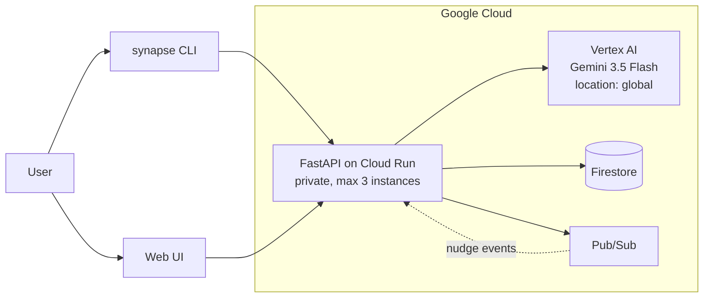

# SynapseNode

A domestic task manager that plans **with** you rather than at you.

Most task apps optimise throughput. SynapseNode carries a 0–1 integer-programming
solver that can do exactly that — and then deliberately puts a second agent in
front of it, one whose job is to weigh your energy, health and rest against the
queue, and to tell you to stop when the signals say stop.

---

## What it does

Give it an unstructured brain-dump of chores. It parses them into a dependency
DAG, scores them, and measures how much uncertainty the queue carries. Then the
**Collaborative Partner** — Gemini 3.5 Flash, reading your live task and
wellbeing state through function calling — talks it through with you.

Depleted (1.5h capacity, receptivity 0.25):

> Given that, I'd strongly recommend taking the evening completely off to rest
> and recharge. But if you really want to do a little something… 1. Spend just
> 15 minutes gathering your tax documents into one pile, then stop. 2. Do
> absolutely nothing productive. Which of those sounds better to you?

Rested (7h capacity, receptivity 0.9), same question — it proposes real work,
still offers rest, still asks. It is not a rest-bot; it is a balanced one.

The **Task Master** solver is still there, reachable at `POST /api/solve`. It
represents the lone-ranger approach the Partner exists to counterbalance.

## Architecture



| Layer | Service |
|---|---|
| Model | Gemini 3.5 Flash via **Vertex AI**, called with the **Google GenAI SDK** (`google-genai`) |
| Compute | Cloud Run — private, scales to zero, capped at 3 instances |
| State | Firestore, with a local JSON fallback so it runs offline |
| Events | Pub/Sub, for asynchronous behavioural nudges |
| Optimiser | PuLP / CBC — 0–1 ILP under an energy-capacity constraint |

`GOOGLE_CLOUD_LOCATION` must be **`global`**. Every Gemini 3.x model returns 404
in `us-central1`, which only serves 2.5 and below. Cloud Run still deploys to
`us-central1`; the two settings are unrelated.

## Spin up locally

Requires Python 3.12+ and the Google Cloud CLI.

```bash
git clone <this repo> && cd gem-agent-hackathon
python3 -m venv venv && venv/bin/pip install -r requirements.txt

# authenticate this machine (writes ADC to your home dir)
gcloud auth application-default login
export GOOGLE_CLOUD_PROJECT=gen-lang-client-0411709036
export GOOGLE_CLOUD_LOCATION=global

venv/bin/python app/main.py          # http://localhost:8080
```

Without credentials it still runs: nudges fall back to local templates and the
Partner reports itself unavailable, rather than crashing.

Enable the APIs once per project:

```bash
gcloud services enable aiplatform.googleapis.com run.googleapis.com \
  firestore.googleapis.com pubsub.googleapis.com \
  cloudbuild.googleapis.com artifactregistry.googleapis.com
```

## Deploy to Cloud Run

```bash
./scripts/synapsectl deploy      # private, capped at 3 instances
./scripts/synapsectl status      # revision, cap, env vars, public/private
./scripts/synapsectl proxy       # browse the private service at :8080
./scripts/synapsectl teardown    # delete it, stopping all spend
```

`proxy` exists because `gcloud run services proxy` cannot install its component
when the Cloud CLI comes from snap. It attaches an identity token per request,
so the service stays private while the UI still loads in a browser.

## CLI

```bash
venv/bin/python scripts/synapse.py add "Clear the garage" "Fix the leaking tap"
venv/bin/python scripts/synapse.py state --energy 1.5 --receptivity 0.25
venv/bin/python scripts/synapse.py tasks
venv/bin/python scripts/synapse.py chat "Free evening. What should I tackle?"
venv/bin/python scripts/synapse.py nudge
venv/bin/python scripts/synapse.py status
```

Targets Cloud Run by default and handles identity tokens for you. Add `--local`
to hit a local server instead.

## API

| Method | Path | |
|---|---|---|
| POST | `/api/partner/chat` | one turn with the Collaborative Partner |
| POST | `/api/partner/reset` | start the conversation over |
| POST | `/api/ingest` | parse an unstructured brain-dump into tasks |
| GET | `/api/tasks` | list tasks |
| POST | `/api/solve` | Task Master ILP solve |
| POST | `/api/complete-task` | mark done, emits a Pub/Sub event |
| POST | `/api/user-state` | set energy and receptivity |
| GET | `/api/diagnostic` | next entropy-reducing question |
| GET | `/api/nudges` | recent behavioural nudges |
| GET | `/api/status` | backing Google Cloud services |

## Tests

```bash
venv/bin/pip install -r requirements-dev.txt
venv/bin/python -m pytest tests/ -q
```

## Cost control

Model spend is bounded in three places: the cognitive-load boundary `B(t)`
gates nudges, so a throttled nudge costs nothing; nudge output is capped at 120
tokens with thinking disabled (Gemini 3.x otherwise spent ~381 reasoning tokens
on a one-line message); and the service is capped at 3 instances and stays
private, so nobody else can invoke it.

Run `./scripts/synapsectl teardown` after recording to stop all spend.
