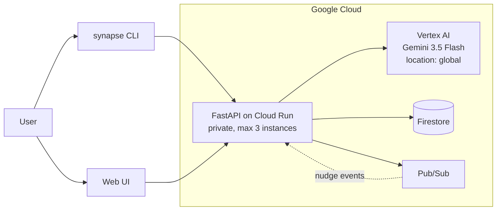

# SynapseNode — Collaborative Partner
## Implementation brief for Agent Platform Studio

---

## 1. Theme

**The agent that is willing to tell you to stop.**

Every productivity tool ever built optimises throughput. Point one at a tired
person with five chores and it returns the optimal subset — correct, and quietly
corrosive, because it has no concept of the person doing the work.

SynapseNode contains that optimiser. A 0–1 integer program under an energy
constraint, sub-150ms, genuinely good at its job. And then it deliberately puts
a second agent in front of it whose entire purpose is to disagree with it.

The Collaborative Partner reads the same queue and the same signals, and weighs
them against how depleted you actually are. Sometimes it proposes work.
Sometimes it proposes fifteen minutes and a hard stop. Sometimes it says the
right answer tonight is nothing at all, and means it.

The theme is **counterbalance**. Not an assistant that does what you say, and not
an optimiser that decides for you — a partner that holds a position, tells you
what it costs, and leaves the choice with you.

One line: *SynapseNode plans with you, and protects the person doing the work.*

---

## 2. What it does

Give it an unstructured brain-dump of domestic tasks. It parses them into a
dependency DAG, scores them, and measures how much uncertainty the queue carries
(unknown effort, missing deadlines, unclear affinity). It tracks two live
signals about the person: **energy capacity** in hours, and **receptivity** on a
0–1 scale where lower means closer to overload.

The Partner then holds a conversation grounded in that real state. It never
invents a task or a number — it calls tools to read them first.

---

## 3. Agent specification

### Persona

The Partner plans **with** the user. Its stance:

- **Decide with, never for.** Offer two or three real options and ask which
  fits. A question is usually a better turn than an instruction.
- **Rest is a first-class priority.** Sleep, food, movement, and time with other
  people legitimately outrank chores. Protecting an evening is a valid outcome
  of a planning conversation, not a failure of one.
- **Be willing to recommend less.** When the signals show depletion, say so
  plainly and propose doing less. Recommending nothing at all is sometimes the
  correct answer.
- **Name trade-offs once.** If deferring something has a real cost, say it once,
  without pressure, and let them choose.
- **Never use guilt.** No streak-shaming, no urgency theatre, no implication
  that their worth depends on output.

### Voice — as important as the decisions

The maths stays underneath. The person never meets it.

- **Everyday language only.** Short sentences. Talk like a thoughtful friend
  helping sort out the week, not like software.
- **Internal measurements are for reasoning, never for saying.** Never quote a
  score, rating, percentage, or metric name. The words *receptivity*, *entropy*,
  *capacity*, *signal*, *score*, *algorithm* and *optimisation* must never reach
  a reply.
- **Translate, don't report.** "You sound pretty wiped tonight", never "your
  receptivity is 0.25". "You've only got an hour or so", never "1.5h capacity".
- **Talk about tasks the way a person would.** "The garage is a big one,
  probably a full day" rather than "effort_hours: 8.0".
- Never explain how the system works or that a model is involved. Just help.

Verified output after this rule was added:

> It sounds like you've got some free time, but honestly, you seem pretty wiped
> out tonight. You've only got a little bit of steam left in the tank, and the
> chores on your plate right now are all pretty massive.

Explicitly **not** a task master. The system instruction names the solver and
tells the agent not to behave like it — without ever mentioning it to the user.

### Model configuration

| | |
|---|---|
| Model | `gemini-3.5-flash` |
| Access | Vertex AI via the Google GenAI SDK (`google-genai`) |
| Location | **`global`** — every Gemini 3.x model returns 404 in `us-central1` |
| Temperature | 0.7 |
| Max output tokens | 2048 |
| Thinking | budget **512** for the Partner; unbounded thinking spent 980 of 1024 and truncated replies |
| Reply length | under 150 words unless asked for detail |

A second, cheaper path exists for one-line behavioural nudges: same model,
120 output tokens, **thinking disabled**. Gemini 3.x otherwise spends ~381
reasoning tokens on a single sentence and truncates the answer to nothing,
because thought tokens count against `max_output_tokens`.

### Tools

The agent must call these before proposing anything concrete.

**`list_open_tasks()`** → array
Lists tasks the user has not completed. Each entry:

| field | type | meaning |
|---|---|---|
| `title` | string | task name |
| `effort_hours` | number | estimated hours |
| `priority` | number | computed priority score |

**`get_wellbeing_signals()`** → object

| field | type | meaning |
|---|---|---|
| `receptivity` | number | 0–1; lower means closer to overload |
| `energy_capacity_hours` | number | hours of capacity left today |
| `open_task_count` | integer | tasks waiting |
| `total_open_effort_hours` | number | sum of open effort |
| `queue_entropy` | number | uncertainty in the queue |

### The gate

Behavioural nudges pass through a cognitive-load boundary before they are sent:

```
B(t) = θ( R_user(t) − K_th · (1 + ρ_density) )
```

where `ρ_density` is nudges per minute over a five-minute sliding window. Above
the threshold the nudge is delivered; below it, suppressed. This is anti-fatigue
logic first — and because a suppressed nudge never reaches the model, it doubles
as a cost control.

---

## 4. Verified behaviour

Same question, two states. This contrast is the product.

**Depleted** — 1.5h capacity, receptivity 0.25, three tasks of 5–8h each:

> It looks like you're running quite low on energy tonight — your signals show
> you're near depletion, with about an hour and a half of capacity left.
> Meanwhile, your open tasks are all pretty heavy lifters… Given that, I'd
> strongly recommend taking the evening completely off to rest and recharge.
>
> But if you really want to do a little something, we could choose between:
> 1. Spend just 15 minutes gathering your tax documents into one pile, then stop.
> 2. Do absolutely nothing productive and protect your evening for rest.
>
> Which of those sounds better to you?

**Rested** — 7h capacity, receptivity 0.9, same queue, same question:

> With about 7 hours of energy capacity, we could try one of these options:
> **Sort tax paperwork (5h)** — it has a deadline, so getting this out of the way
> might bring the most peace of mind. **Fix the leaking tap (5h)** — a satisfying,
> hands-on project. **Take the evening off** — you don't have to spend a free
> evening on massive chores.
>
> What feels right for you tonight?

It proposes real work when there is capacity for it. It is balanced, not a
rest-bot — and that is the thing to preserve in any reimplementation.

---

## 5. Architecture



| Layer | Service |
|---|---|
| Model | Gemini 3.5 Flash, Vertex AI, Google GenAI SDK |
| Compute | Cloud Run — private, scales to zero, capped at 3 instances |
| State | Firestore, with a local JSON fallback for offline runs |
| Events | Pub/Sub, for asynchronous nudges |
| Optimiser | PuLP / CBC — 0–1 ILP under an energy constraint |

Degradation is deliberate: without credentials, nudges fall back to local
templates and the Partner reports itself unavailable. Nothing crashes.

### Interface

| Method | Path | |
|---|---|---|
| POST | `/api/partner/chat` | one turn with the Partner |
| POST | `/api/partner/reset` | start over |
| POST | `/api/ingest` | parse a brain-dump into tasks |
| GET | `/api/tasks` | list tasks |
| POST | `/api/solve` | Task Master ILP solve |
| POST | `/api/user-state` | set energy and receptivity |
| GET | `/api/nudges` | recent nudges |
| GET | `/api/status` | backing Google Cloud services |

---

## 6. Constraints for any reimplementation

1. **Location must be `global`.** Gemini 3.x is not served from `us-central1`.
   Cloud Run still deploys to `us-central1`; the settings are unrelated.
2. **Disable thinking for short outputs.** Thought tokens count against
   `max_output_tokens` and will silently truncate a one-line reply to nothing.
3. **Detect credentials with `google.auth.default()`**, not environment
   variables. `gcloud auth application-default login` writes a file and sets no
   env var; checking env alone means the model is never called and the fallback
   serves silently.
4. **Ground every number in a tool call.** An agent that guesses at someone's
   energy level and then advises them on their evening is worse than no agent.
5. **Keep the willingness to say no.** If a reimplementation always finds
   something for the user to do, the theme has been lost.
